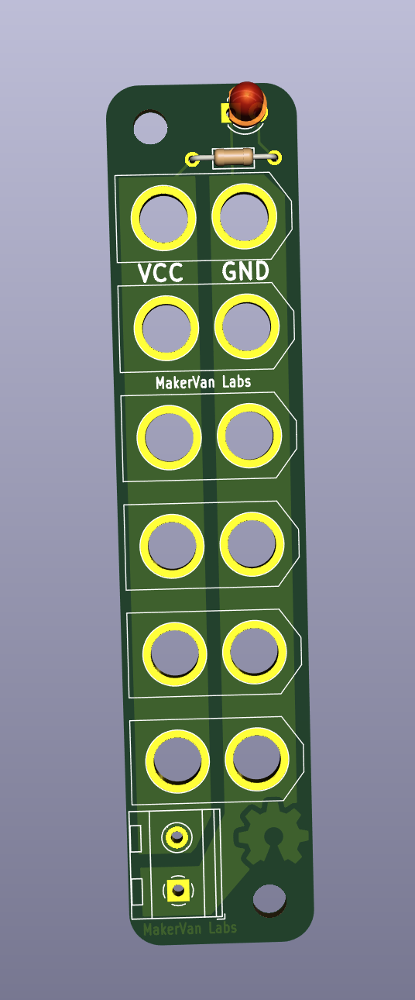

# Powerhub XT60

A distribution board for up to 6 XT60 connectors (male or female), with optional power LED as well as screw terminals.

## License
This board is released under the MIT License.

* Based on the [XT60 Board](https://github.com/jesseaster/xt60board)
* Credit for the XT60.kicad_mod goes to https://pappkopp.com/?p=222
